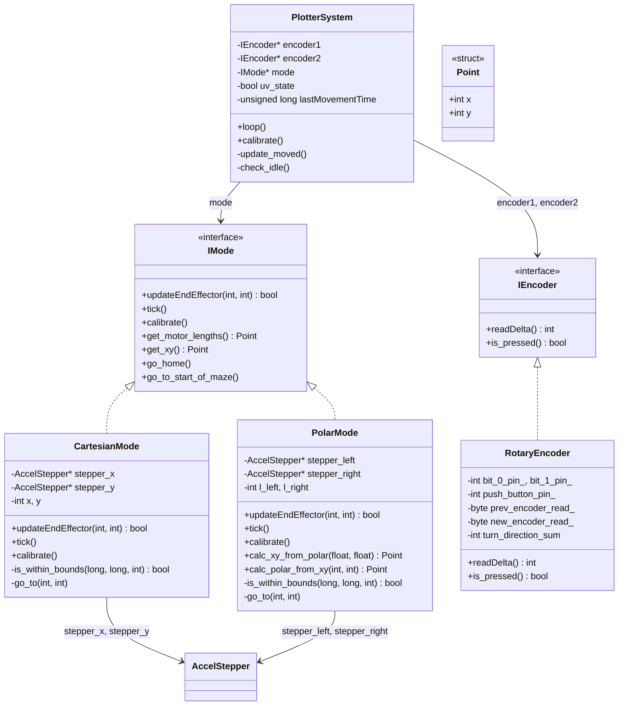

[Project Logs](https://docs.google.com/document/d/1AlCwlF5sB7dfxrVR6inSUOw-NSQJLXzD55TbnAXokts/edit?usp=sharing)

# Cartesian & Polar Plotter

A dual-mode 2D plotter control system built for a Science Museum exhibit. Users draw on a UV-sensitive canvas using rotary encoder wheels that drive stepper motors positioning a UV pen (the end effector).

Two plotter types share the same codebase:
- **Cartesian** - A CNC-gantry [X-Y plotter](https://en.wikipedia.org/wiki/Plotter) ([example build](https://www.instructables.com/X-Y-Plotter/))
- **Polar** - A [Polargraph-style](https://www.instructables.com/Polargraph-Drawing-Machine/) cable-driven plotter

Both are controlled by 2 rotary wheels connected to encoders. The Arduino reads the encoders and drives the motors accordingly. The UV light turns on automatically when the user moves the wheels and turns off after inactivity.

---

## Installation & Setup

### Prerequisites

- [VSCode](https://code.visualstudio.com/) with the [PlatformIO extension](https://platformio.org/install/ide?install=vscode)

> This guide covers building via VSCode. For PlatformIO CLI usage, refer to the [PlatformIO CLI docs](https://docs.platformio.org/en/latest/core/index.html).

### Install the AccelStepper Library

The only external dependency is the **AccelStepper** library. Install it using one of:

1. **Arduino IDE**: Open Library Manager and search for "AccelStepper"
2. **Direct download**: https://www.arduinolibraries.info/libraries/accel-stepper

The library must be placed in `~/Documents/Arduino/libraries/` (configured via `lib_extra_dirs` in `platformio.ini`).

## Hardware

- **MCU**: Arduino Nano (ATmega328P)
- **Motors**: 2x NEMA17 stepper motors driven by A4988 stepper drivers
- **Input**: 2x Mechanical rotary encoders with push buttons ([example](https://www.aliexpress.com/item/1005005239756119.html))
- **End effector**: UV LED (draws on photosensitive canvas)
- **Polar mode only**: 2x Magnetic sensors for counterweight position detection during calibration
- **Custom PCB shield** - schematics and PCB layouts in the `doc/` folder

---

## How It Works

### Calibration

**Cartesian**: Drives X motor to the mechanical limit (stall detection), offsets back to center, drops Y motor (disable/re-enable outputs to let gravity pull it down), then offsets Y upward. Sets position to (0,0).

**Polar**: Reels cables up, then lowers counterweights until the magnetic sensors detect them. At that known position, calculates the cable lengths corresponding to the home coordinates and sets the stepper positions accordingly.

### Main Loop

```
┌─────────────────────────────────────────────────┐
│ Read encoder deltas (gray code quadrature)      │
│         ↓                                       │
│ mode->updateEndEffector(delta1, delta2)          │
│   ├── Check bounds (with deadband)              │
│   ├── [Polar] Convert cable lengths ↔ XY        │
│   └── Command steppers to new target positions  │
│         ↓                                       │
│ mode->tick()  (non-blocking motor stepping)     │
│         ↓                                       │
│ If moved → turn on UV LED, reset idle timer     │
│ If idle  → turn off UV (3s), auto-home (60s)    │
└─────────────────────────────────────────────────┘
```

### Boundary Enforcement

Soft limits prevent the end effector from leaving the drawable area. A 5-unit deadband at the edges prevents jittery behavior — when the position enters the deadband, coordinates are updated (so the user doesn't get "stuck") but motors don't move to the extreme edge. The Polar mode has an additional extended zone near the maze exit.

### UV LED Behavior

- Turns **on** automatically when the user moves
- Turns **off** after 3 seconds of inactivity (`UV_AUTO_TURN_OFF_TIME`)
- After 60 seconds idle (`GO_TO_START_OF_MAZE`), the plotter automatically returns to the maze starting position

---

## Project Structure

```
├── platformio.ini              # PlatformIO build config (board, libs, serial speed)
├── README.md
├── src/
│   ├── main.cpp                # Entry point: creates objects and runs the main loop
│   ├── Settings.h              # Global pin definitions, flags, and shared config
│   ├── CartesianSettings.h     # Cartesian mode parameters (speeds, limits, offsets)
│   ├── PolarSettings.h         # Polar mode parameters (speeds, limits, geometry)
│   ├── IMode.h                 # Abstract interface for plotter modes
│   ├── CartesianMode.h         # Cartesian (X-Y gantry) implementation
│   ├── PolarMode.h             # Polar (cable-driven) implementation
│   ├── IEncoder.h              # Abstract interface for encoders
│   ├── RotaryEncoder.h         # Mechanical rotary encoder implementation
│   └── PlotterSystem.h         # Main controller: ties encoders, motors, and mode together
└── doc/
    ├── Schematic_Shield_*.pdf          # Arduino shield schematic
    ├── PCB_Shield_*.pdf                # Shield PCB layout
    ├── Schematic_A4988_to_FET_drive_*.pdf  # Motor driver schematic
    ├── PCB_A4988_to_FET_drive_*.pdf    # Motor driver PCB layout
    ├── A4988-Datasheet.pdf             # A4988 stepper driver datasheet
    └── nema17-datasheet.pdf            # NEMA17 motor datasheet
```

All source files are **header-only** (no `.cpp` files besides `main.cpp`).

---

## Architecture & OOP Design

The project uses interface-based polymorphism to support both plotter types with the same controller logic.

### Class Diagram



### Class Responsibilities

| Class | Role |
|-------|------|
| `IMode` | Abstract interface defining the contract for any plotter mode |
| `CartesianMode` | Implements `IMode` for an X-Y gantry. Encoder deltas map directly to X/Y stepper positions |
| `PolarMode` | Implements `IMode` for a cable-driven plotter. Converts between cable lengths and Cartesian coordinates using geometric calculations |
| `IEncoder` | Abstract interface for reading rotational input and button state |
| `RotaryEncoder` | Decodes 2-bit gray code quadrature from mechanical encoders. Accumulates 4 state transitions per click for noise immunity |
| `PlotterSystem` | Main controller. Reads encoders, delegates to the active mode via `updateEndEffector()` and `tick()`, and manages the UV LED auto-on/off and idle auto-home. Has no direct motor references — motors are fully owned by the mode |
| `Point` | Simple struct holding `{int x, int y}` coordinates |

---

## Configuration

All configuration is done via `#define` constants in header files.

### Compile-Time Flags (`Settings.h`)

| Flag | Default | Description |
|------|---------|-------------|
| `USE_POLAR_MODE` | `true` | `true` = Polar mode, `false` = Cartesian mode |
| `ENABLE_SOFT_LIMIT` | `true` | Enable software boundary checking |
| `PRODUCTION_MODE` | `true` | Disables debug button handlers |
| `DEBUG_MODE` | `false` | Enables serial debug output for geometric calculations |
| `ENCODER_DEBUG` | `false` | Enables serial debug output for encoder readings |

### Mode-Specific Parameters

`CartesianSettings.h` defines the Cartesian mode parameters: max speed and acceleration per axis, stepper step size multiplier, X/Y soft limits (in motor steps), homing offsets, and the maze starting position. It also supports a `MINI_SETUP` flag for a smaller tabletop version of the plotter.

`PolarSettings.h` defines the Polar mode parameters: max speed and acceleration, stepper step size multiplier, the physical distance between motors, steps-per-mm conversion factor, X/Y soft limits (in mm from the top-left motor), home and maze-start coordinates, magnetic sensor pins, and an extended boundary zone near the maze exit.

---

### Polar Coordinate Math

The polar plotter converts between cable lengths (l1, l2) and Cartesian coordinates (x, y) using two-circle intersection geometry. Origin (0,0) is at the top-left motor, X is positive rightward, Y is positive downward.

**XY → Cable lengths:**
```
l1 = sqrt(y² + (MOTORS_DISTANCE - x)²)    // left cable
l2 = sqrt(y² + x²)                        // right cable
```

**Cable lengths → XY:**
```
x = (l1² - l2² - d²) / (-2d)     where d = MOTORS_DISTANCE
y = sqrt(l2² - x²)
```

